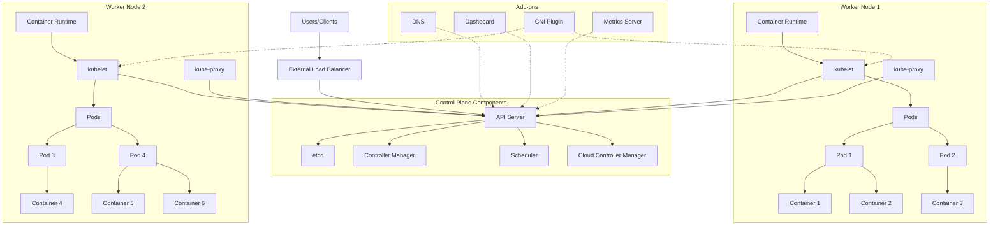
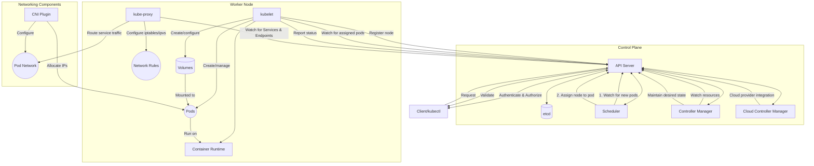
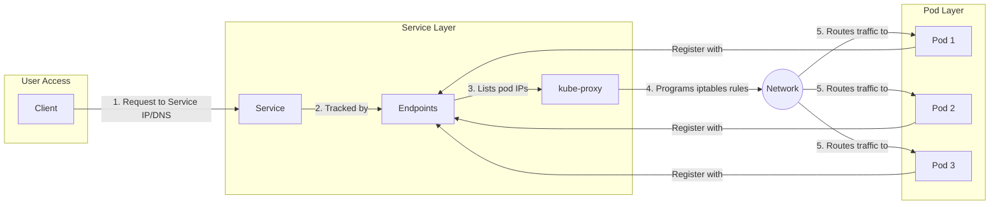
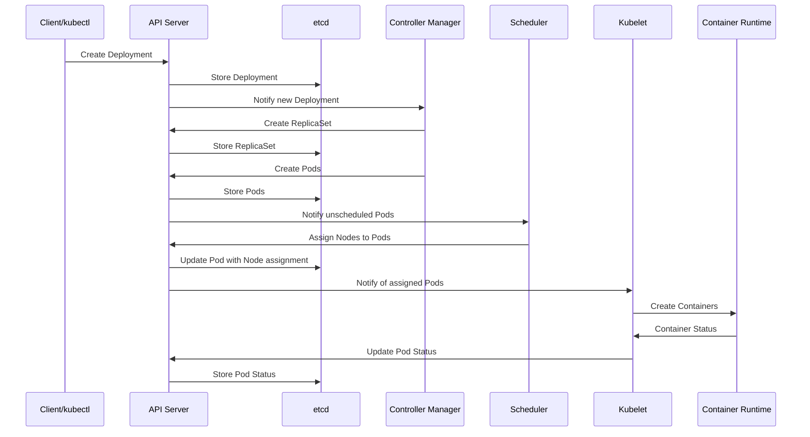
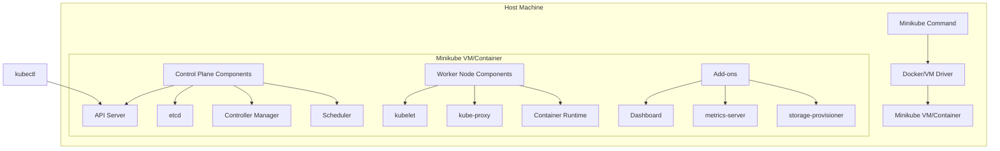

# Kubernetes Architecture Diagram

## High-Level Kubernetes Architecture

## Detailed Component Relationships

## Service Architecture

## Deployment Process

## Minikube Architecture

## Key Components Explained

### Control Plane
- **API Server**: The central management point that receives all REST requests for modifications to the cluster state
- **etcd**: Consistent and highly-available key-value store used as Kubernetes' backing store for all cluster data
- **Controller Manager**: Runs controller processes that regulate the state of the cluster
- **Scheduler**: Watches for newly created pods that have no node assigned and selects a node for them to run on

### Worker Nodes
- **kubelet**: An agent that runs on each node and ensures that containers are running in a pod
- **kube-proxy**: Maintains network rules on nodes that allow network communication to your pods
- **Container Runtime**: Software responsible for running containers (e.g., Docker, containerd, CRI-O)

### Add-ons
- **DNS**: Cluster DNS for service discovery
- **Dashboard**: Web-based UI for cluster management
- **Metrics Server**: Collects resource usage data from kubelets
- **CNI Plugin**: Configures pod networking and implements the Kubernetes networking model